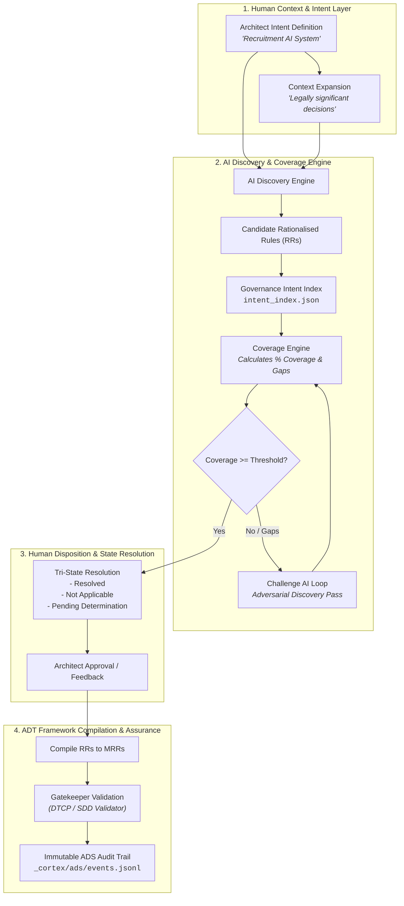
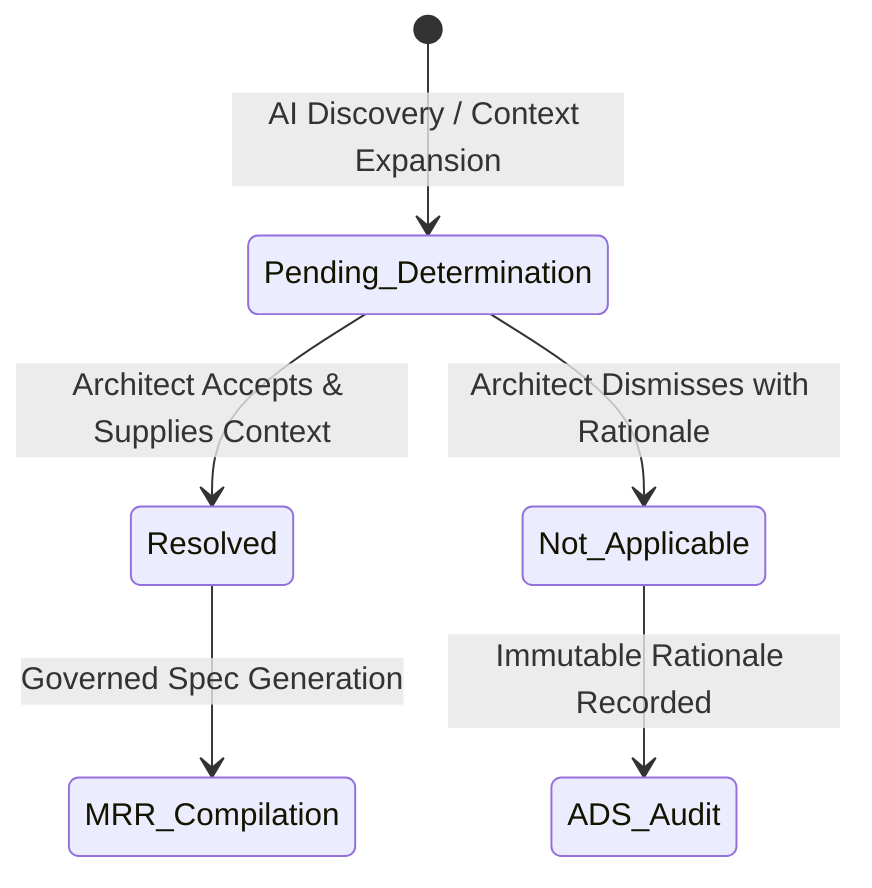
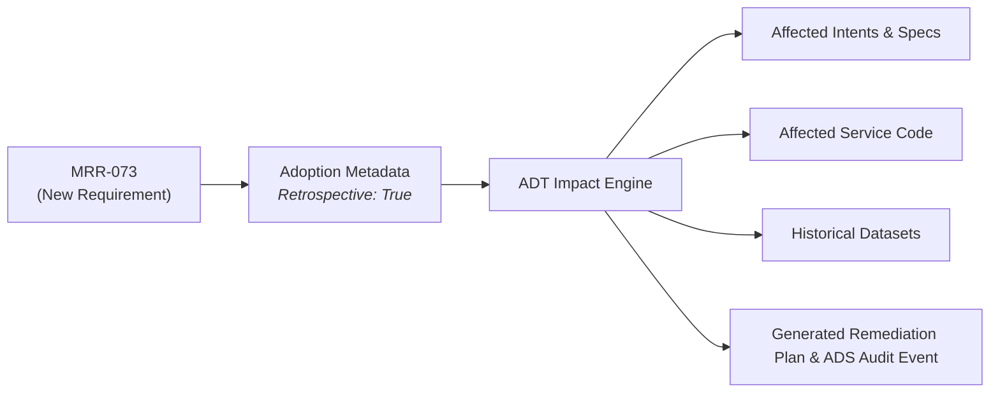
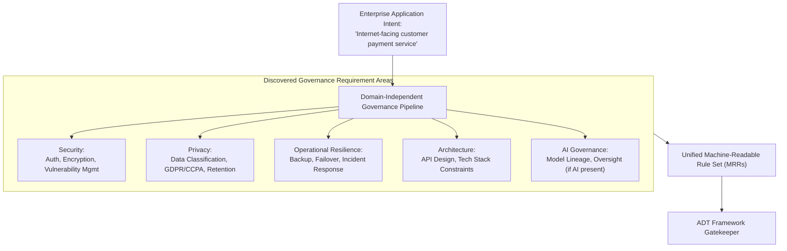
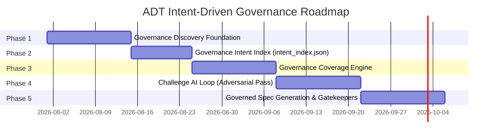

# Architectural Feasibility Assessment: ADT Intent-Driven Governance Assurance

> [!NOTE]
> **Executive Summary & Verdict:**  
> **Feasibility Rating: 9.5 / 10 (Extremely High Feasibility)**  
> The proposed **Intent-Driven Governance Assurance** pipeline is not only technically feasible within the ADT (Advanced Digital Transformation) Framework, but it represents a natural, high-value evolution of ADT's existing **SPEC-063** (Standards & Rationalised Rules Engine). ADT already possesses the foundational data structures (`RationalisedRule`, `MachineReadableRule`, `Disposition`), append-only JSONL ledgers, SDD validation gatekeepers, and ADS audit event logging. Implementing this proposal requires targeted additions (Governance Intent Index, Quantitative Coverage Engine, Adversarial Challenge AI Loop, and Adoption Metadata), all of which build cleanly on top of ADT's existing architecture.

---

## 1. System Architecture Alignment & Gap Analysis

ADT's current standards layer converts static standard clauses (e.g., UNESCO AI, EU AI Act, ISO 42001) into **Rationalised Rules (RRs)** and **Machine-Readable Rules (MRRs)**. The Intent-Driven Governance Assurance model elevates this process from static clause selection to **dynamic AI-assisted discovery grounded by human judgment and quantitative baselines**.



### Architectural Mapping & Gap Analysis

| Capability Area | Current ADT State | Proposed Vision | Feasibility & Effort |
| :--- | :--- | :--- | :--- |
| **Separation of Roles** | Manual standard assignment via UI/API (`governance_routes.py`) | Intent defined by Architect; Rules discovered by AI; Execution gated by ADT | **High Feasibility** (Native fit for ADT's existing human-in-the-loop design) |
| **Rule Ledgers** | Append-only stores `rationalised_rules.jsonl` & `machine_readable_rules.jsonl` | Governed RR/MRR generation driven by discovered intent | **Native / Ready** (Direct reuse of `adt_core/standards/`) |
| **Intent Index Baseline** | Standards imported statically into `_cortex/standards/` | Domain-to-rule index (`intent_index.json`) for quantitative benchmarking | **Low Effort** (New JSON schema & baseline lookup utility) |
| **Coverage Engine** | Manual disposition counting | Quantitative math comparing discovered RRs vs expected baseline domain rules | **Medium Effort** (Mathematical coverage calculator module) |
| **Adversarial Challenge Loop** | Single-pass AI assistance | Self-auditing adversarial LLM subagent searching for missing obligations | **Medium Effort** (Subagent prompt pattern & loop runner) |
| **Tri-State Model** | `Disposition` enum: `pending`, `adopted`, `adapted`, `dismissed` | Tri-State resolution: `Resolved`, `Not Applicable`, `Pending Determination` | **Low Effort** (Extends existing `Disposition` taxonomy seamlessly) |
| **Adoption Metadata** | Temporal fields (`created_at`, `decided_at`) | Decoupled governance adoption metadata (`retrospective_remediation`, `exceptions`) | **Low Effort** (Field additions to `RationalisedRule` & `MachineReadableRule`) |

---

## 2. Core Technical Feasibility Breakdown

### 2.1 Separation of Responsibilities

ADT strictly segregates responsibilities across three core entities:

1. **Architect (Human Context & Authority):** Defines high-level business purpose, constraints, and operational context. Retains sole authority to approve, challenge, or reject governance interpretations and resolve ambiguity.
2. **AI Discovery Engine (Requirement Extraction & Challenge):** Performs automated semantic parsing of intent against regulatory bodies (EU AI Act, UNESCO, ISO 42001, corporate security frameworks). Converts standard clauses into candidate Rationalised Rules (RRs).
3. **ADT Framework (Execution Gatekeeping & Audit):** Compiles approved RRs into Machine-Readable Rules (MRRs), calculates coverage scores, executes pre-build SDD validation, and records every state transition in the immutable **ADS (Authoritative Data Source)** event ledger (`_cortex/ads/events.jsonl`).

> [!IMPORTANT]
> **Architectural Advantage:** AI never self-approves rules, and humans are never forced to manually write standards rules from scratch. The AI proposes, the human disposes, and ADT enforces.

---

### 2.2 Quantitative Coverage Math & Benchmark Engine

To ensure the AI Discovery Engine is non-arbitrary and measurable, ADT introduces a **Governance Intent Index** (`config/intent_index.json`). This index categorizes domain intent signatures into baseline governance expectations.

#### Quantitative Coverage Formulation:
$$\text{Coverage Score (\%)} = \left( \frac{|R_{\text{discovered}} \cap R_{\text{expected}}|}{|R_{\text{expected}}|} \right) \times 100\%$$

Where:
* $R_{\text{expected}}$ = Set of expected governance rules defined in `intent_index.json` for the domain (e.g., 100 rules for `domain: recruitment_decisions`).
* $R_{\text{discovered}}$ = Set of Rationalised Rules (RRs) synthesized by the AI Discovery Engine.

#### Discovery & Adversarial Loop Walkthrough:
1. **Initial Pass:** AI discovers 94 candidate RRs matching expected baseline $\rightarrow$ **94% Coverage**. Missing areas flagged: *Appeals Process*, *Bias Monitoring*.
2. **Architect Action:** Selects `🔍 Challenge AI`.
3. **Adversarial Pass:** Adversarial agent executes prompt:
   ```text
   Assume critical governance requirements have been overlooked.
   Re-scan standards and justify any additional mandatory constraints for:
   Intent: 'Recruitment decision support system'
   Context: 'Legally significant decision, UK cross-border data transfer'
   ```
4. **Recalculation:** +5 RRs added (Bias Monitoring, Appeals Process, Human Escalation) $\rightarrow$ **99% Coverage**. 1 requirement remains as `Pending Determination`.

---

### 2.3 Tri-State Governance Resolution Model

ADT maps the requirement lifecycle into three explicit state outcomes:



* **`Resolved`:** Rationalised Rule accepted. Source clause, rationale, and target spec parameters are recorded.
* **`Not Applicable`:** Formally excluded by the architect. Rationale is mandatory (e.g., *"System does not store biometric data"*), preserving human accountability.
* **`Pending Determination`:** Information gap identified. System prompts architect for specific missing context (e.g., *"Does the system make or influence decisions affecting individuals?"*).

---

### 2.4 Governance Evolution & Retrospective Remediation

Governance standards evolve over time. When a new requirement (e.g., `MRR-073`: *"Every AI decision shall record the model version used"*) is introduced, ADT treats governance adoption as **first-class metadata** rather than modifying rule logic inline.

#### Adoption Metadata Structure:
```json
{
  "rule_id": "MRR-073",
  "title": "Model Version Logging Mandatory",
  "introduced_at": "2026-01-01T00:00:00Z",
  "applicability": "existing_and_future_systems",
  "retrospective_remediation": true,
  "compliance_deadline": "2026-12-31T23:59:59Z",
  "exceptions": ["archived_immutable_records"]
}
```

#### Automated Impact & Remediation Graph:
When `retrospective_remediation` is `true`, ADT leverages its lineage graph to automatically evaluate impact:

$$\text{Impact Scope} = \text{GraphTraversal}(\text{MRR-073}) \implies \{ \text{Intents}, \text{Specs}, \text{Code Repos}, \text{Datasets}, \text{ADS Logs} \}$$



> [!TIP]
> **Key Insight:** ADT does not decide if a new rule is retrospective—that is a policy decision by the governing authority recorded in adoption metadata. Once recorded, ADT automates 100% of the downstream impact discovery and remediation planning.

---

### 2.5 Multi-Domain Governance Pipeline (Beyond AI)

The proposed architecture is completely domain-agnostic. AI governance is treated as one facet alongside Security, Privacy, Resilience, and Architectural Governance.



---

## 3. Implementation Roadmap

The implementation can be executed in 5 structured phases, minimizing risk and delivering incremental value at each stage:



### Phase Details & Key Deliverables

1. **Phase 1: Governance Discovery Foundation**
   * **Deliverables:** Intent capture endpoint, initial standard parsing via LLM discovery, basic UI in ADT Center for approval/rejection.
   * **ADT Touchpoints:** `adt_center/api/governance_routes.py`, `adt_core/standards/rationalisation.py`.

2. **Phase 2: Governance Intent Index**
   * **Deliverables:** Creation of `config/intent_index.json` schema mapping domain keywords/intents to mandatory baseline rules.
   * **ADT Touchpoints:** `adt_core/standards/schema.py`.

3. **Phase 3: Governance Coverage Engine**
   * **Deliverables:** Implementation of quantitative coverage algorithm ($Coverage\%$), tri-state resolution handler (`Resolved`, `N/A`, `Pending Determination`), and ADS event logging for state changes.
   * **ADT Touchpoints:** `adt_core/standards/coverage.py` (new), `adt_core/ads/logger.py`.

4. **Phase 4: Challenge AI Loop**
   * **Deliverables:** Multi-agent adversarial discovery subagent (`invoke_subagent` pattern), recalculation engine, gap notification UI.
   * **ADT Touchpoints:** `adt_core/standards/challenge_agent.py` (new).

5. **Phase 5: Governed Spec Generation & Gatekeeper Integration**
   * **Deliverables:** Compiler converting approved RRs to MRRs, integration with SDD validator (`adt_core/sdd/validator.py`), and pre-commit build gatekeeper.
   * **ADT Touchpoints:** `adt_core/sdd/validator.py`, `adt_center/static/js/standards_mrr.js`.

---

## 4. Key Risks & Mitigation Strategies

| Risk | Impact | Mitigation Strategy |
| :--- | :--- | :--- |
| **LLM Discovery Hallucination** | High | Ground AI discovery strictly against ingested standards in `_cortex/standards/` and validate against `intent_index.json`. |
| **Architect Decision Fatigue** | Medium | Present pre-rationalised rules with clear recommendations, filtering out redundant clauses into single RRs. |
| **Retrospective Remediation Gaps** | Medium | Enforce complete lineage tracking in ADS events so every spec parameter links back to an MRR ID and Intent ID. |
| **Non-Deterministic Coverage Scores** | Low | Seed discovery prompts with deterministic parameters and enforce canonical clause hashing. |

---

## 5. Conclusion & Strategic Recommendation

The **ADT Intent-Driven Governance Assurance** framework is **fully sound, architecturally feasible, and highly aligned with ADT's existing core design**. It solves the fundamental governance bottleneck—moving away from manual rule authoring while preserving human authority and guaranteeing end-to-end machine-enforced auditability.

**Recommendation:** Proceed immediately with **Phase 1 & Phase 2** prototyping within `adt_core/standards/` and `adt_center/`.
